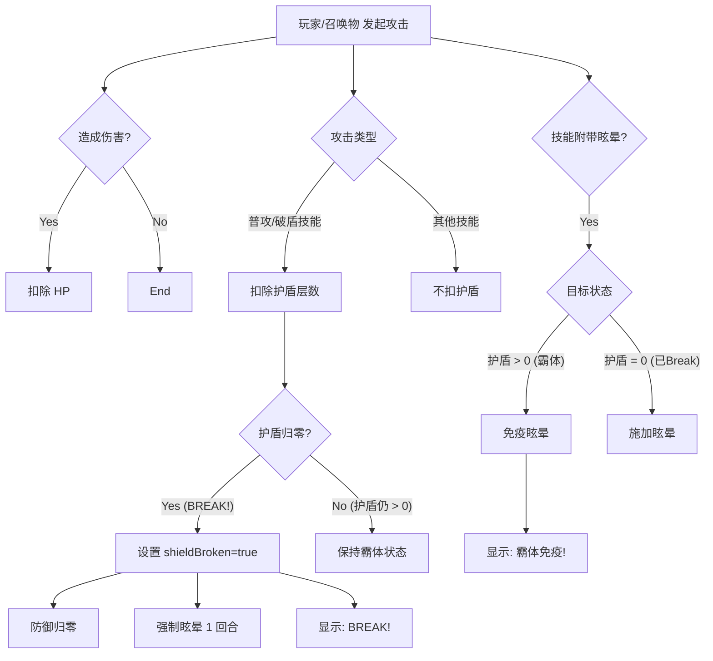

# 《八方旅人》风格 Break 系统设计文档

## 1. 核心理念
引入“霸体”机制，强化 BOSS 战的策略性。玩家必须先通过特定手段（普攻或破盾技能）将 BOSS 的护盾层数削减至 0，触发 **BREAK** 状态，才能对其进行有效控制（眩晕）和高额输出。

## 2. 机制详解

### 2.1 霸体状态 (Iron Body)
*   **触发条件**：目标的当前护盾值 `currentShield > 0`。
*   **效果**：
    *   **免疫眩晕**：任何来源的眩晕（Stun）效果都会无效化。
    *   **高防御**：维持原有的高防御力（当前代码已实现）。
    *   **反馈**：当尝试对霸体单位施加眩晕时，战斗日志或飘字显示 **“🛡️ 霸体免疫！”**。

### 2.2 破盾瞬间 (BREAK!)
*   **触发条件**：目标的当前护盾值从 `> 0` 变为 `0` 的那一瞬间。
*   **效果**：
    *   **强制眩晕**：无视抗性，强制使目标眩晕 1 回合（失去行动机会）。
    *   **防御崩溃**：防御力（DEF）降为 0（当前代码已实现）。
    *   **易伤状态**：受到的伤害不再被护盾减免（当前代码已实现）。
    *   **反馈**：显示 **“💥 BREAK! 护盾破碎！”**。

### 2.3 护盾恢复
*   **触发条件**：BOSS 行动回合开始时，如果处于 Break 状态（shieldBroken = true）。
*   **效果**：护盾恢复至满值，防御力恢复，解除 Break 状态（当前代码已实现）。

## 3. 详细交互流程



## 4. 受影响的技能与效果
以下情况在 BOSS **有护盾** 时将无法触发眩晕：

1.  **主动技能眩晕**：如德克萨斯的《眩晕》技能。
2.  **概率被动眩晕**：如迷迭香的攻击/余震附带概率眩晕。
3.  **召唤物特性**：如召唤物攻击附带眩晕（stunOnHit）。
4.  **装备/词缀效果**：如果未来有“攻击概率眩晕”的装备。

## 5. 代码修改计划 (js/skillEffects.js)

需要修改以下函数，植入“霸体检测”逻辑：

1.  **`executeStunEffect`** (主动眩晕):
    *   增加检查：`if (target.currentShield > 0 && !target.shieldBroken)` -> `return` 并提示免疫。

2.  **`executeDamageEffect`** (伤害附带眩晕):
    *   在处理 `stunChance` 逻辑前，增加霸体检查。
    *   在处理 `stunOnHit` (召唤物) 逻辑前，增加霸体检查。

3.  **`executeAftershockEffect`** (迷迭香余震):
    *   在处理余震眩晕逻辑前，增加霸体检查。

4.  **`executeShieldBreakEffect`** (破盾技能):
    *   **注意**：此函数会导致护盾归零。逻辑必须确保在护盾归零的**当次**处理中，眩晕能够生效（因为这是 Break 的奖励），但如果护盾未归零，则不能由其他附带效果导致眩晕。

## 6. 待确认事项
*   **击退效果**：目前游戏中似乎还没有“击退行动条”的技能。如果有，是否也要免疫？（建议：通常 Break 系统也免疫击退，或者击退效果减半。目前暂无此机制，可暂不考虑。）
*   **强制剧情杀**：是否有剧情强制眩晕的需求？（如果有，需要加一个 `ignoreImmunity` 标志）。

---

## 7. 伤害类型与交互规则 (补充 v2.0)

我们将引入 `DMG_SOURCE` 枚举来精细控制破盾和反伤的交互逻辑。

### 7.1 伤害来源分类

| 来源类型 | 代码常量 | 典型例子 | 破盾能力 (Break) | 触发反伤 (Reflect) |
| :--- | :--- | :--- | :---: | :---: |
| **直接攻击** | `DIRECT` | 普攻、单体技能、AOE技能 | ✅ 是 | ✅ 是 |
| **环境伤害** | `ENVIRONMENT` | 余震 (迷迭香)、溅射 (点燃)、冲击波 | ✅ 是 | ❌ **否** |
| **持续伤害** | `DOT` | 毒、灼烧、流血 | ❌ 否 | ❌ 否 |

### 7.2 逻辑伪代码

```javascript
// 定义伤害类型枚举 (js/skillCore.js)
export const DMG_SOURCE = {
    DIRECT: 'direct',       // 直接攻击
    ENVIRONMENT: 'env',     // 环境/余震
    DOT: 'dot'              // 持续伤害
};

/**
 * 终极版伤害处理函数逻辑 (executeDamageEffect)
 */
function applyDamage(attacker, defender, damage, sourceType = DMG_SOURCE.DIRECT) {
    
    // 1. 破盾判定 (Break System)
    // 直接攻击和环境冲击都能削减护盾
    if (defender.shield > 0) {
        if (sourceType === DMG_SOURCE.DIRECT || sourceType === DMG_SOURCE.ENVIRONMENT) {
            defender.shield = Math.max(0, defender.shield - 1);
            console.log(`🔨 [BREAK] 护盾 -1 (剩余 ${defender.shield})`);
            
            if (defender.shield === 0) triggerBreak(defender);
        }
        // 未破盾时的减伤逻辑 (保持原有逻辑)
        // damage = Math.floor(damage * 0.3); // 示例
    }

    // 2. 扣血
    defender.hp -= damage;

    // 3. 反伤判定 (Reflect System)
    // 只有 [直接攻击] 才会触发反伤
    if (sourceType === DMG_SOURCE.DIRECT && hasAffix(defender, 'reflect')) {
        doReflect(attacker, defender, damage);
    } else if (sourceType === DMG_SOURCE.ENVIRONMENT) {
        console.log(`🌊 [SAFE] 余震冲击波造成伤害，未触发反伤！`);
    }
}
```

### 7.3 更新计划
*   在 `js/skillCore.js` 中定义并导出 `DMG_SOURCE`。
*   重构 `js/skillEffects.js` 中的 `executeDamageEffect`，增加 `sourceType` 参数并实现上述逻辑。
*   更新 `executeAftershockEffect` 和 `executeSplashDamage`，调用伤害函数时传入 `DMG_SOURCE.ENVIRONMENT`。
