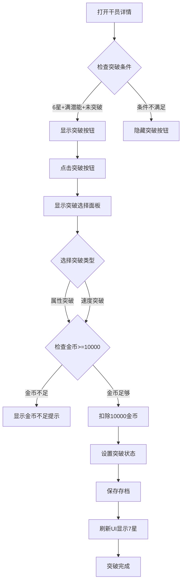

# 干员突破功能设计文档

## 1. 功能需求

### 1.1 突破条件
- **星级要求**：6星干员
- **潜能要求**：满潜能（13级）
  - 潜能1级为初始获得
  - 每次重复抽取+1潜能，共12次可达满潜
  - 满潜能时已有+60%属性加成（12 × 5% = 60%）
- **资源消耗**：10000 金币

### 1.2 突破效果（二选一）
| 选项 | 名称 | 效果 | 说明 |
|------|------|------|------|
| 选项一 | 属性突破 | HP/ATK/DEF +100%（总计） | 将原有的+60%补满至+100% |
| 选项二 | 速度突破 | SPD +40% | 额外获得40%速度加成，其他属性保持+60% |

### 1.3 视觉效果
- 突破后干员显示**7颗星**（原6星+1颗突破星🌟）
- 突破星使用金色或特殊样式区分

## 2. 技术设计

### 2.1 数据结构修改

#### [`js/state.js`](js/state.js) - 干员库存结构扩展
```javascript
// 现有结构
state.inventory[name] = { 
  count: 1, 
  potential: 1 
}

// 扩展后结构
state.inventory[name] = { 
  count: 1, 
  potential: 1,
  breakthrough: null  // null=未突破, 'stats'=属性突破, 'speed'=速度突破
}
```

### 2.2 配置扩展

#### [`js/config.js`](js/config.js) - 添加突破配置
```javascript
// 在 CONFIG 对象中添加
BREAKTHROUGH: {
  REQUIRED_RARITY: 6,           // 需要6星
  REQUIRED_POTENTIAL: 13,       // 需要满潜能
  GOLD_COST: 10000,             // 突破消耗10000金币
  STATS_BONUS_TOTAL: 1.0,       // 属性突破：总计+100%（从+60%补至+100%）
  SPEED_BONUS: 0.4,             // 速度突破：+40%速度
  EXTRA_STARS: 1                // 额外显示1颗星
}
```

### 2.3 属性计算修改

#### [`js/config.js`](js/config.js) - 修改属性计算函数
```javascript
// 现有函数（保留）
export function applyPotentialBonus(baseValue, potential) {
  const bonus = 1 + (potential - 1) * CONFIG.POTENTIAL_BONUS_PER_LEVEL;
  return Math.floor(baseValue * bonus);
}

// 新增突破属性计算函数
export function applyBreakthroughBonus(baseValue, potential, breakthrough, stat = 'normal') {
  // 基础潜能加成
  let bonus = 1 + (potential - 1) * CONFIG.POTENTIAL_BONUS_PER_LEVEL;
  
  // 突破加成
  if (breakthrough === 'stats') {
    // 属性突破：HP/ATK/DEF 总计+100%
    if (stat !== 'spd') {
      bonus = 1 + CONFIG.BREAKTHROUGH.STATS_BONUS_TOTAL;
    }
  } else if (breakthrough === 'speed' && stat === 'spd') {
    // 速度突破：速度+40%（其他属性保持原有+60%）
    bonus = 1 + CONFIG.BREAKTHROUGH.SPEED_BONUS;
  }
  
  return Math.floor(baseValue * bonus);
}

// 获取干员显示星级
export function getDisplayRarity(rarity, breakthrough) {
  if (breakthrough) {
    return rarity + CONFIG.BREAKTHROUGH.EXTRA_STARS;
  }
  return rarity;
}

// 检查是否可以突破
export function canBreakthrough(rarity, potential, breakthrough) {
  return rarity >= CONFIG.BREAKTHROUGH.REQUIRED_RARITY && 
         potential >= CONFIG.BREAKTHROUGH.REQUIRED_POTENTIAL && 
         !breakthrough;
}
```

### 2.4 UI修改

#### [`js/charDetail.js`](js/charDetail.js) - 干员详情页添加突破功能
```javascript
// 在 showCharDetail 函数中添加突破按钮显示逻辑
function renderBreakthroughButton(charName) {
  const data = CHARACTER_DATA[charName];
  const info = state.inventory[charName];
  
  if (!canBreakthrough(data.rarity, info.potential, info.breakthrough)) {
    return '';  // 不满足条件，不显示按钮
  }
  
  return `
    <div class="char-detail-btn-breakthrough" onclick="openBreakthroughPanel('${charName}')">
      <div class="control-btn-flex">🌟</div>
      <span class="btn-text">突破</span>
    </div>
  `;
}

// 突破选择面板
function openBreakthroughPanel(charName) {
  const cost = CONFIG.BREAKTHROUGH.GOLD_COST;
  
  // 显示两个选项的模态框
  showModal('🌟 干员突破', `
    <div class="breakthrough-panel">
      <p>选择突破方向（消耗 ${cost} 金币）：</p>
      <div class="breakthrough-options">
        <div class="breakthrough-option" onclick="confirmBreakthrough('${charName}', 'stats')">
          <div class="breakthrough-icon">💪</div>
          <div class="breakthrough-name">属性突破</div>
          <div class="breakthrough-desc">HP/ATK/DEF 加成从+60%提升至+100%</div>
        </div>
        <div class="breakthrough-option" onclick="confirmBreakthrough('${charName}', 'speed')">
          <div class="breakthrough-icon">⚡</div>
          <div class="breakthrough-name">速度突破</div>
          <div class="breakthrough-desc">获得+40%速度加成<br>其他属性保持+60%</div>
        </div>
      </div>
      <p class="breakthrough-warning">⚠️ 突破后无法更改，请谨慎选择！</p>
    </div>
  `, true);
}

// 确认突破
function confirmBreakthrough(charName, type) {
  const cost = CONFIG.BREAKTHROUGH.GOLD_COST;
  
  // 检查金币是否足够
  if (state.gold < cost) {
    showModal('❌ 金币不足', `
      <p>突破需要 ${cost} 金币</p>
      <p>当前金币：${state.gold}</p>
      <button class="btn btn-primary" onclick="closeModal();">确定</button>
    `, false);
    return;
  }
  
  // 扣除金币并设置突破
  store.consumeGold(cost);
  store.setBreakthrough(charName, type);
  
  showModal('✨ 突破成功！', `
    <p>${charName} 已完成${type === 'stats' ? '属性' : '速度'}突破！</p>
    <p>${type === 'stats' ? 'HP/ATK/DEF加成提升至+100%' : '获得+40%速度加成'}</p>
    <p>消耗 ${cost} 金币</p>
    <button class="btn btn-primary" onclick="closeModal(); refreshCharDetail();">确定</button>
  `, false);
}
```

#### [`js/team.js`](js/team.js) - 队伍页面显示突破状态
```javascript
// 在 renderTeamSlots 中修改星级显示
const info = state.inventory[charName];
const displayRarity = getDisplayRarity(data.rarity, info?.breakthrough);
const normalStars = '★'.repeat(data.rarity);
const breakthroughStar = info?.breakthrough ? '<span class="breakthrough-star">🌟</span>' : '';
const stars = normalStars + breakthroughStar;
```

#### [`js/battle.js`](js/battle.js) - 战斗时应用突破加成
```javascript
// 在 startBattle 函数中修改属性计算
battle.allies = team.map((name, index) => {
  const data = CHARACTER_DATA[name];
  const potential = state.inventory[name]?.potential || 1;
  const breakthrough = state.inventory[name]?.breakthrough || null;
  
  return {
    id: `ally_${name}_${Date.now()}_${index}`,
    name,
    rarity: data.rarity,
    hp: applyBreakthroughBonus(data.hp, potential, breakthrough, 'hp'),
    atk: applyBreakthroughBonus(data.atk, potential, breakthrough, 'atk'),
    def: applyBreakthroughBonus(data.def, potential, breakthrough, 'def'),
    spd: applyBreakthroughBonus(data.spd, potential, breakthrough, 'spd'),
    skills: [...data.skills],
    currentHp: applyBreakthroughBonus(data.hp, potential, breakthrough, 'hp'),
    maxHp: applyBreakthroughBonus(data.hp, potential, breakthrough, 'hp'),
    energy: 0,
    maxEnergy: 100,
    buffAtk: 0,
    buffAtkMultiplier: 0,
    buffSpd: 0,
    stunDuration: 0,
    isEnemy: false,
    isLeader: index === 0,
    isSummoner: data.summoner || false,
    isSummon: false,
    breakthrough: breakthrough,  // 保存突破状态
    unitId: `ally-${name}-${Date.now()}-${index}`
  };
});
```

### 2.5 Store方法扩展

#### [`js/state.js`](js/state.js) - 添加突破相关方法
```javascript
class GameStore {
  // ... 现有方法 ...
  
  // 设置干员突破
  setBreakthrough(name, type) {
    if (state.inventory[name]) {
      state.inventory[name].breakthrough = type;
      this.save();
    }
  }
  
  // 获取干员突破状态
  getBreakthrough(name) {
    return state.inventory[name]?.breakthrough || null;
  }
}
```

### 2.6 CSS样式

#### [`css/style.css`](css/style.css) - 添加突破UI样式
```css
/* 突破按钮 */
.char-detail-btn-breakthrough {
  background: linear-gradient(135deg, #ffd700 0%, #ff8c00 100%);
  border: 2px solid #ffd700;
  border-radius: 12px;
  padding: 12px;
  cursor: pointer;
  text-align: center;
  transition: all 0.3s ease;
}

.char-detail-btn-breakthrough:hover {
  transform: scale(1.05);
  box-shadow: 0 0 20px rgba(255, 215, 0, 0.6);
}

/* 突破选择面板 */
.breakthrough-panel {
  text-align: center;
  padding: 20px;
}

.breakthrough-options {
  display: flex;
  justify-content: center;
  gap: 20px;
  margin: 20px 0;
  flex-wrap: wrap;
}

.breakthrough-option {
  background: linear-gradient(135deg, #2a2a4e 0%, #1a1a3e 100%);
  border: 2px solid #ffd700;
  border-radius: 12px;
  padding: 20px;
  cursor: pointer;
  transition: all 0.3s ease;
  width: 200px;
}

.breakthrough-option:hover {
  transform: scale(1.05);
  box-shadow: 0 0 20px rgba(255, 215, 0, 0.5);
  border-color: #ffeb3b;
}

.breakthrough-icon {
  font-size: 48px;
  margin-bottom: 10px;
}

.breakthrough-name {
  font-size: 18px;
  font-weight: bold;
  color: #ffd700;
  margin-bottom: 8px;
}

.breakthrough-desc {
  font-size: 14px;
  color: #aaa;
  line-height: 1.4;
}

.breakthrough-warning {
  color: #ff6b6b;
  font-size: 12px;
  margin-top: 15px;
}

/* 突破星标识 */
.breakthrough-star {
  color: #ffd700;
  text-shadow: 0 0 10px #ffd700, 0 0 20px #ff8c00;
  animation: starGlow 1.5s ease-in-out infinite alternate;
}

@keyframes starGlow {
  from {
    text-shadow: 0 0 5px #ffd700, 0 0 10px #ff8c00;
  }
  to {
    text-shadow: 0 0 15px #ffd700, 0 0 25px #ff8c00;
  }
}

/* 7星干员卡片样式 */
.char-item.star-7,
.team-slot.star-7 {
  border-color: #ff6b00;
  background: linear-gradient(135deg, #1a1a2e 0%, #2a1a1e 100%);
  box-shadow: 0 0 15px rgba(255, 107, 0, 0.3);
}

/* 突破标识 */
.breakthrough-badge {
  position: absolute;
  top: 5px;
  right: 5px;
  background: linear-gradient(135deg, #ffd700 0%, #ff8c00 100%);
  color: #000;
  font-size: 10px;
  padding: 2px 6px;
  border-radius: 4px;
  font-weight: bold;
}
```

## 3. 实施步骤

### 第一步：数据层修改
1. 修改 [`js/config.js`](js/config.js)
   - 添加 `BREAKTHROUGH` 配置
   - 添加 `applyBreakthroughBonus()` 函数
   - 添加 `getDisplayRarity()` 函数
   - 添加 `canBreakthrough()` 函数

2. 修改 [`js/state.js`](js/state.js)
   - 在 `GameStore` 类中添加 `setBreakthrough()` 方法
   - 确保存档迁移兼容性

### 第二步：战斗逻辑修改
3. 修改 [`js/battle.js`](js/battle.js)
   - 在 `startBattle()` 中使用新的属性计算函数
   - 导入新的属性计算函数

### 第三步：UI层修改
4. 修改 [`js/charDetail.js`](js/charDetail.js)
   - 添加突破按钮（在右侧按钮栏）
   - 添加突破选择面板逻辑
   - 更新属性显示（应用突破加成）
   - 更新星级显示

5. 修改 [`js/team.js`](js/team.js)
   - 更新星级显示（7星）
   - 更新属性显示

6. 修改 [`css/style.css`](css/style.css)
   - 添加突破相关的CSS样式

### 第四步：测试
7. 测试用例：
   - 测试6星满潜能干员显示突破按钮
   - 测试5星或非满潜能不显示突破按钮
   - 测试金币不足时的提示
   - 测试属性突破后的属性计算
   - 测试速度突破后的速度计算
   - 测试战斗中属性正确应用
   - 测试7星显示效果
   - 测试存档保存和加载

## 4. 流程图



## 5. 属性计算示例

以艾雅法拉为例（6星，基础ATK=220，基础SPD=80）：

### 属性突破选择
| 状态 | ATK计算 | ATK结果 | SPD计算 | SPD结果 |
|------|---------|---------|---------|---------|
| 1级潜能 | 220 × 1.0 | 220 | 80 × 1.0 | 80 |
| 13级潜能（满潜） | 220 × 1.6 | 352 | 80 × 1.0 | 80 |
| **属性突破后** | 220 × 2.0 | **440** | 80 × 1.0 | 80 |

### 速度突破选择
| 状态 | ATK计算 | ATK结果 | SPD计算 | SPD结果 |
|------|---------|---------|---------|---------|
| 13级潜能（满潜） | 220 × 1.6 | 352 | 80 × 1.0 | 80 |
| **速度突破后** | 220 × 1.6 | 352 | 80 × 1.4 | **112** |

**注意**：速度突破时，HP/ATK/DEF 保持原有的+60%潜能加成不变。

## 6. 注意事项

1. **存档兼容性**：新字段 `breakthrough` 默认为 `null`，老存档自动兼容
2. **不可逆设计**：突破一旦选择不可更改，需要确认提示
3. **资源检查**：突破前需检查金币是否足够（10000金币）
4. **UI反馈**：突破成功需要明显的视觉反馈
5. **性能考虑**：属性计算频繁调用，需要简单高效

## 7. 文件修改清单

| 文件 | 修改内容 |
|------|----------|
| [`js/config.js`](js/config.js) | 添加BREAKTHROUGH配置、属性计算函数 |
| [`js/state.js`](js/state.js) | 添加setBreakthrough方法 |
| [`js/battle.js`](js/battle.js) | 使用新属性计算函数 |
| [`js/charDetail.js`](js/charDetail.js) | 添加突破按钮和面板 |
| [`js/team.js`](js/team.js) | 显示7星和突破属性 |
| [`css/style.css`](css/style.css) | 添加突破相关样式 |