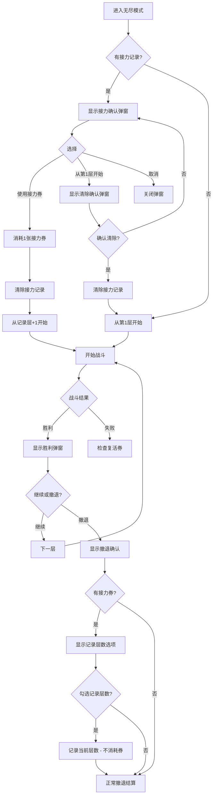

# 接力券功能设计文档

## 一、需求分析

### 功能描述
接力券是一种无尽模式道具，效果如下：
1. 当玩家拥有接力券时，在**战斗胜利后撤退**时，会记录撤退的层数
2. 下次进入无尽模式时，可以选择从**撤退层数+1**的楼层继续游戏
3. **战斗中撤退**（失败撤退）不触发接力券效果

### 与复活券对比

| 特性 | 复活券 | 接力券 |
|------|--------|--------|
| 触发时机 | 战斗失败（全军覆没） | 战斗胜利后撤退 |
| 效果 | 重新挑战当前层，全队满血 | 记录层数，下次从该层+1开始 |
| 消耗时机 | 使用时消耗 | 使用时消耗 |
| 持续性 | 即时效果 | 持久化记录 |

## 二、技术实现方案

### 2.1 状态管理 (js/state.js)

```javascript
// DEFAULT_STATE 添加
relayTickets: 0,         // 接力券数量

// GameStore 添加方法
addRelayTickets(amount)      // 增加接力券
consumeRelayTicket()         // 消耗1张接力券
getRelayTickets()            // 获取接力券数量
```

### 2.2 无尽模式进度存储 (GameDB)

在 `endless_progress` 中新增字段：
```javascript
{
  maxFloorReached: number,   // 已有
  relayFloor: number | null  // 新增：记录的撤退层数
}
```

### 2.3 配置文件 (js/config.js)

```javascript
ENDLESS_SHOP: {
  REVIVE_TICKET: { ... },  // 已有
  RELAY_TICKET: {          // 新增
    name: '接力券',
    icon: '🔗',
    desc: '战斗胜利后撤退时记录层数，下次可从该层继续',
    price: 800             // 无尽币价格
  }
}
```

### 2.4 商店系统 (js/shop.js)

- `renderEndlessShop()` 中添加接力券商品
- `buyRelayTicket()` 新增购买接力券方法
- `updateCurrency()` 更新接力券显示

### 2.5 UI显示 (js/ui.js)

`updateResourceUI()` 更新接力券显示

### 2.6 HTML (index.html)

资源栏和商店页面添加接力券显示元素

### 2.7 无尽模式逻辑 (js/endless_and_smartAI/endless.js)

#### 新增属性
```javascript
EndlessMode = {
  // ...existing...
  relayFloor: null,  // 记录的撤退层数
}
```

#### 修改 loadProgress()
```javascript
async loadProgress() {
  const saved = await GameDB.settings.get('endless_progress');
  if (saved && saved.value) {
    this.maxFloorReached = saved.value.maxFloorReached || 0;
    this.relayFloor = saved.value.relayFloor || null;  // 新增
  }
}
```

#### 修改 saveProgress()
```javascript
async saveProgress() {
  await GameDB.settings.put({
    id: 'endless_progress',
    value: {
      maxFloorReached: this.maxFloorReached,
      relayFloor: this.relayFloor  // 新增
    }
  });
}
```

#### 修改 start() - 在现有逻辑中添加接力检查
```javascript
async start() {
  // ...existing team validation...
  
  // 【新增】检查是否有接力记录
  if (this.relayFloor && this.relayFloor > 0) {
    this.showRelayConfirmModal();
    return;
  }
  
  // ...existing logic continues...
}
```

#### 新增：showRelayConfirmModal() - 接力确认弹窗
```javascript
// 注意：有接力记录时必定有接力券（因为记录层数需要有接力券）
showRelayConfirmModal() {
  const relayCount = store.getRelayTickets();
  
  const content = `
    <div class="relay-confirm">
      <p style="font-size:18px;">🔗 检测到接力记录！</p>
      <div class="relay-info">
        <p>上次撤退层数: 第 <b>${this.relayFloor}</b> 层</p>
        <p>可从第 <b>${this.relayFloor + 1}</b> 层继续挑战</p>
      </div>
      <hr>
      <p>🎫 接力券: <b>${relayCount}</b> 张</p>
      <p style="color:#90ee90;">使用接力将消耗 1 张接力券</p>
      <div class="endless-buttons" style="margin-top:20px;">
        <button id="relay-use" class="btn-primary">使用接力券（消耗1张）</button>
        <button id="relay-skip" class="btn-secondary">从第1层开始</button>
        <button id="relay-cancel" class="btn-secondary">取消</button>
      </div>
    </div>
  `;
  
  showModal('🔗 接力确认', content, false);
  
  setTimeout(() => {
    document.getElementById('relay-use')?.addEventListener('click', async () => {
      // 消耗接力券
      const success = await store.consumeRelayTicket();
      if (!success) {
        alert('接力券不足！');
        return;
      }
      
      const startFloor = this.relayFloor;
      
      // 清除接力记录
      this.relayFloor = null;
      await this.saveProgress();
      
      closeModal();
      
      // 从记录的层数开始（currentFloor会在nextFloor中+1）
      this.active = true;
      this.currentFloor = startFloor;
      this.totalRewards = { gold: 0, tickets: 0 };
      this.currentBuffs = [];
      
      addBattleLog(`🔗 使用接力！从第 ${startFloor + 1} 层开始！`, 'system');
      this.nextFloor();
    });
    
    document.getElementById('relay-skip')?.addEventListener('click', () => {
      // 不使用接力，显示清除确认弹窗
      closeModal();
      this.showClearRelayConfirmModal();
    });
    
    document.getElementById('relay-cancel')?.addEventListener('click', () => {
      closeModal();
    });
  }, 100);
}
```

#### 新增：showClearRelayConfirmModal() - 清除接力记录确认弹窗
```javascript
showClearRelayConfirmModal() {
  const content = `
    <div class="clear-relay-confirm">
      <p style="font-size:18px;color:#ff6b6b;">⚠️ 确定要清除接力记录吗？</p>
      <div class="relay-info">
        <p>当前记录: 第 <b>${this.relayFloor}</b> 层</p>
        <p style="color:#888;">清除后将无法恢复</p>
      </div>
      <div class="endless-buttons" style="margin-top:20px;">
        <button id="clear-confirm" class="btn-danger">确认清除并开始</button>
        <button id="clear-cancel" class="btn-secondary">返回</button>
      </div>
    </div>
  `;
  
  showModal('🗑️ 清除确认', content, false);
  
  setTimeout(() => {
    document.getElementById('clear-confirm')?.addEventListener('click', async () => {
      // 清除接力记录
      this.relayFloor = null;
      await this.saveProgress();
      
      closeModal();
      
      // 从第1层开始
      this.active = true;
      this.currentFloor = 0;
      this.totalRewards = { gold: 0, tickets: 0 };
      this.currentBuffs = [];
      this.nextFloor();
    });
    
    document.getElementById('clear-cancel')?.addEventListener('click', () => {
      closeModal();
      // 返回接力确认弹窗
      this.showRelayConfirmModal();
    });
  }, 100);
}
```

#### 修改 showRetreatConfirmModal() - 胜利后撤退（手动选择记录层数）
```javascript
showRetreatConfirmModal() {
  const relayCount = store.getRelayTickets();
  
  // 计算无尽币
  // ...
  
  // 只有拥有接力券时才显示记录选项
  let relaySection = '';
  if (relayCount > 0) {
    relaySection = `
      <div class="relay-section">
        <p>🔗 你有 <b>${relayCount}</b> 张接力券</p>
        <p>记录层数后，下次可从第 <b>${this.currentFloor + 1}</b> 层继续</p>
        <p style="color:#888;font-size:12px;">（使用接力时消耗接力券，记录不消耗）</p>
        <label class="relay-checkbox-label">
          <input type="checkbox" id="record-relay-checkbox">
          <span>记录当前层数</span>
        </label>
      </div>
    `;
  }
  
  const content = `
    <div class="retreat-confirm">
      <p style="font-size:18px;color:#ff6b6b;">⚠️ 确定要撤退吗？</p>
      <div class="retreat-info">
        <p>当前层数: 第 <b>${this.currentFloor}</b> 层</p>
        <p>撤退后将获得以下奖励:</p>
        <div class="retreat-rewards">
          <p>💰 金币: ${this.totalRewards.gold}</p>
          <p>🎫 抽卡券: ${this.totalRewards.tickets}</p>
          <p>🎖️ 无尽币: ${estimatedEndlessCoin}</p>
        </div>
      </div>
      <hr>
      ${relaySection}
      <div class="endless-buttons" style="margin-top:20px;">
        <button id="retreat-confirm" class="btn-danger">确认撤退</button>
        <button id="retreat-cancel" class="btn-secondary">继续挑战</button>
      </div>
    </div>
  `;
  
  showModal('🚪 撤退确认', content, false);
  
  // 绑定事件
  setTimeout(() => {
    document.getElementById('retreat-confirm')?.addEventListener('click', async () => {
      // 检查是否勾选了记录层数
      const recordCheckbox = document.getElementById('record-relay-checkbox');
      if (recordCheckbox && recordCheckbox.checked) {
        // 记录层数（不消耗接力券）
        this.relayFloor = this.currentFloor;
        await this.saveProgress();
        addBattleLog(`🔗 已记录接力层数: 第 ${this.currentFloor} 层`, 'system');
      }
      closeModal();
      await this.end(true);
    });
    
    document.getElementById('retreat-cancel')?.addEventListener('click', () => {
      closeModal();
      // 重新显示胜利弹窗
      const rewards = this.currentStage.rewards;
      this.showVictoryModal(rewards);
    });
  }, 100);
}
```

#### 修改 end() - 撤退时不再处理接力券逻辑
接力券的记录逻辑已移至 `showRetreatConfirmModal()` 中的确认按钮事件处理器。
`end()` 函数保持原有逻辑不变，无需额外修改。

## 三、流程图



**说明**：
1. 有接力记录时必定有接力券（因为只有拥有接力券才能记录层数）
2. 选择"从第1层开始"时会弹出二次确认，确认后清除接力记录

## 四、修改文件清单

| 文件 | 修改内容 |
|------|----------|
| `js/state.js` | 添加 `relayTickets` 状态和相关方法 |
| `js/config.js` | 添加 `RELAY_TICKET` 配置 |
| `js/shop.js` | 添加接力券商品和购买逻辑 |
| `js/ui.js` | 更新 `updateResourceUI()` |
| `index.html` | 添加接力券显示元素 |
| `js/endless_and_smartAI/endless.js` | 核心逻辑实现 |
| `css/style.css` | 可选：添加接力券相关样式 |

## 五、注意事项

1. **战斗中撤退不触发**：只有战斗胜利后的撤退才能使用接力券
2. **接力记录持久化**：`relayFloor` 需要保存到 IndexedDB
3. **使用后清除**：使用接力后立即清除记录，防止重复使用
4. **一次性消耗**：记录层数时**不消耗**接力券，**使用接力时**消耗
5. **UI一致性**：接力券显示风格与复活券保持一致