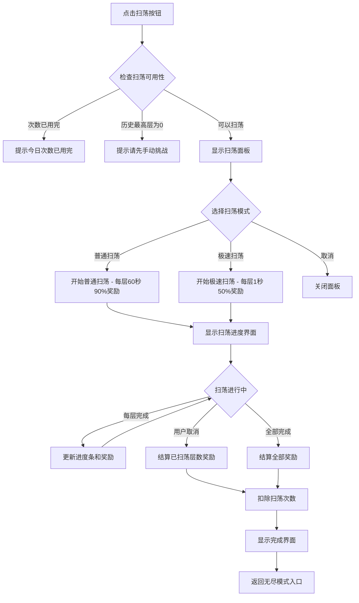
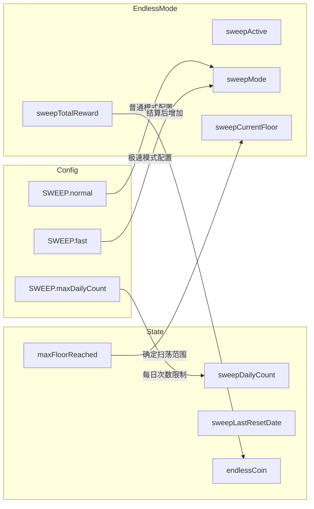

# 无尽扫荡系统实现计划

## 一、现有代码结构分析

### 1.1 相关文件
- [`js/state.js`](js/state.js) - 游戏状态管理，包含 `DEFAULT_STATE` 和 `GameStore` 类
- [`js/config.js`](js/config.js) - 游戏配置常量
- [`js/endless_and_smartAI/endless.js`](js/endless_and_smartAI/endless.js) - 无尽模式核心逻辑
- [`js/ui.js`](js/ui.js) - UI通用函数
- [`css/style.css`](css/style.css) - 样式文件

### 1.2 现有无尽模式结构
- `EndlessMode` 对象包含：状态管理、敌人生成、战斗逻辑、奖励计算
- `showEndlessMode()` 函数：无尽模式入口UI
- 奖励计算函数 [`calculateRewards()`](js/endless_and_smartAI/endless.js:522) 已存在
- 历史最高层 `maxFloorReached` 已在 state 中定义

---

## 二、实现步骤详解

### 步骤1: 更新数据结构 (state.js)

在 `DEFAULT_STATE` 中添加扫荡相关字段：

```javascript
// 在 DEFAULT_STATE 对象中添加（约第50行后）
sweepDailyCount: 0,        // 今日已扫荡次数
sweepLastResetDate: "",    // 上次重置日期 (格式: "YYYY-MM-DD")
```

### 步骤2: 添加扫荡配置 (config.js)

在 `CONFIG` 对象中添加扫荡配置：

```javascript
// 在 CONFIG 对象中添加（建议放在 ENDLESS_COIN 配置后面）
SWEEP: {
  maxDailyCount: 3,           // 每日最大次数
  normal: {
    timePerFloor: 60,         // 每层时间（秒）- 普通扫荡
    rewardRate: 0.9,          // 奖励效率 90%
    name: '普通扫荡'
  },
  fast: {
    timePerFloor: 1,          // 每层时间（秒）- 极速扫荡
    rewardRate: 0.5,          // 奖励效率 50%
    name: '极速扫荡'
  }
}
```

### 步骤3: GameStore 类添加扫荡方法 (state.js)

在 `GameStore` 类中添加：

```javascript
// --- 扫荡系统管理 ---

// 检查并重置每日扫荡次数
checkSweepDailyReset() {
  const today = new Date().toISOString().split('T')[0]; // "YYYY-MM-DD"
  if (state.sweepLastResetDate !== today) {
    state.sweepDailyCount = 0;
    state.sweepLastResetDate = today;
    this.save();
  }
}

// 获取今日剩余扫荡次数
getSweepRemaining() {
  this.checkSweepDailyReset();
  const maxCount = CONFIG.SWEEP?.maxDailyCount || 3;
  return maxCount - (state.sweepDailyCount || 0);
}

// 消耗一次扫荡次数
consumeSweepCount() {
  this.checkSweepDailyReset();
  const maxCount = CONFIG.SWEEP?.maxDailyCount || 3;
  if ((state.sweepDailyCount || 0) < maxCount) {
    state.sweepDailyCount = (state.sweepDailyCount || 0) + 1;
    this.save();
    return true;
  }
  return false;
}
```

### 步骤4: 实现扫荡核心逻辑 (endless.js)

在 `EndlessMode` 对象中添加扫荡相关属性和方法：

```javascript
// 扫荡状态（在 EndlessMode 对象顶部添加）
sweepActive: false,
sweepMode: null,        // 'normal' 或 'fast'
sweepCurrentFloor: 0,
sweepTotalReward: 0,
sweepCancelled: false,
sweepTimer: null,

// 核心方法
canSweep()              // 检查扫荡可用性
startSweep(mode)        // 开始扫荡
cancelSweep()           // 取消扫荡
finishSweep()           // 完成扫荡结算
calculateSweepReward()  // 计算单层扫荡奖励
```

### 步骤5: 扫荡UI入口 (endless.js)

修改 `showEndlessMode()` 函数，添加扫荡按钮：

```javascript
// 在无尽模式入口界面添加扫荡按钮
<button id="start-sweep" class="btn-secondary">扫荡</button>
```

### 步骤6: 扫荡面板UI (endless.js)

添加新函数 `showSweepPanel()`：

```javascript
// 显示扫荡选择面板
showSweepPanel() {
  // 检查可用性
  // 显示模式选择（普通/极速）
  // 显示预计时间和奖励
}
```

### 步骤7: 扫荡进度界面 (endless.js)

添加新函数 `showSweepProgress()`：

```javascript
// 显示扫荡进度
showSweepProgress() {
  // 当前层数/总层数
  // 进度条
  // 已获得奖励
  // 剩余时间
  // 取消按钮
}
```

### 步骤8: 扫荡完成界面 (endless.js)

添加新函数 `showSweepComplete()`：

```javascript
// 显示扫荡完成结算
showSweepComplete() {
  // 扫荡层数范围
  // 获得奖励
  // 今日剩余次数
  // 确定按钮
}
```

### 步骤9: CSS样式 (style.css)

添加扫荡相关样式：

```css
/* 扫荡面板样式 */
.sweep-panel { ... }
.sweep-mode-btn { ... }
.sweep-progress { ... }
.sweep-progress-bar { ... }
```

---

## 三、扫荡流程图



---

## 四、数据流图



---

## 五、文件修改清单

| 文件 | 修改内容 | 优先级 |
|------|----------|--------|
| `js/state.js` | 添加扫荡字段到 DEFAULT_STATE | P0 |
| `js/state.js` | GameStore 添加扫荡方法 | P0 |
| `js/config.js` | 添加 SWEEP 配置 | P0 |
| `js/endless_and_smartAI/endless.js` | 添加扫荡状态属性 | P0 |
| `js/endless_and_smartAI/endless.js` | 实现 canSweep() | P0 |
| `js/endless_and_smartAI/endless.js` | 实现 startSweep() | P0 |
| `js/endless_and_smartAI/endless.js` | 实现 showSweepPanel() | P0 |
| `js/endless_and_smartAI/endless.js` | 实现 showSweepProgress() | P1 |
| `js/endless_and_smartAI/endless.js` | 实现 cancelSweep() | P1 |
| `js/endless_and_smartAI/endless.js` | 实现 showSweepComplete() | P1 |
| `js/endless_and_smartAI/endless.js` | 修改 showEndlessMode() 添加入口 | P0 |
| `css/style.css` | 添加扫荡UI样式 | P1 |

---

## 六、注意事项

1. **存档兼容性**: 老存档没有 `sweepDailyCount` 和 `sweepLastResetDate` 字段时，使用默认值 `0` 和 `""`
2. **扫荡不更新历史最高层**: 扫荡只获取奖励，不刷新 `maxFloorReached`
3. **扫荡与手打互斥**: 扫荡期间 `sweepActive = true`，不能开始手动挑战
4. **奖励计算复用**: 使用现有的 `calculateFloorReward()` 或 `calculateRewards()` 函数
5. **无尽币计算**: 扫荡完成后也应该获得相应的无尽币奖励

---

## 七、测试要点

1. 每日重置逻辑（跨天测试）
2. 扫荡次数限制
3. 普通扫荡和极速扫荡的时间差异
4. 扫荡中途取消的奖励结算
5. 扫荡完成的奖励发放
6. 老存档兼容性测试
7. 扫荡进度条动画流畅度