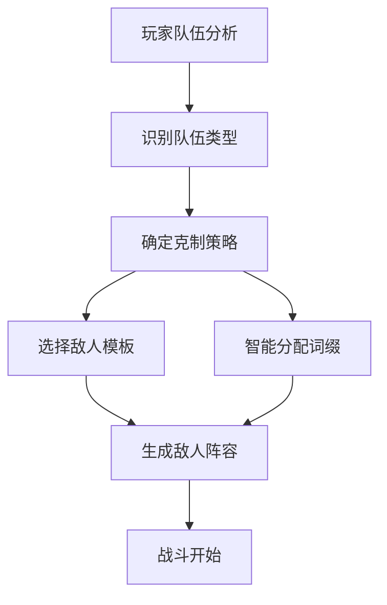
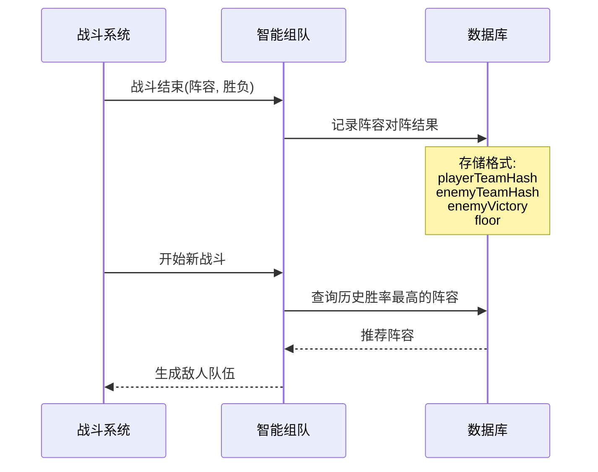

# 智能敌人组队系统设计方案

> **状态**: 待实现  
> **前置条件**: 需要完善职业系统  
> **创建日期**: 2026-01-01

## 概述

让AI从**敌人组队阶段**就开始针对玩家，而不只是战斗中的决策。AI会分析玩家队伍特点，生成最佳的敌人阵容和词缀组合来克制玩家。

## 核心流程



## 玩家队伍分析维度

| 维度 | 识别方式 | 针对策略 |
|------|----------|----------|
| **治疗能力** | healer标记（夜莺等） | 配置高爆发+刺客优先击杀 |
| **召唤能力** | summoner标记（缪尔赛思） | 刺客斩首召唤师 |
| **高爆发** | 高ATK+爆发技能（艾雅法拉） | 不死/分裂词缀+坦克吸收 |
| **控制能力** | 眩晕等技能 | 高速敌人抢先行动 |
| **高速度** | 高SPD角色（红/陈） | 更高速度敌人 |

> **注意**: 当前游戏中 ATK 和 DEF 是统一的，没有物理/法术区分。

## 敌人角色定位

### 坦克定位
- **模板**: 重装兵
- **特点**: 高HP + 高DEF
- **最佳词缀**: 
  - 嘲讽(taunt) - 强制敌人优先攻击
  - 闪避(dodge) - 20%闪避率
  - 不死(undying) - 首次致死恢复30%HP
  - 坚韧(fortify) - DEF+25%

### 刺客定位
- **模板**: 萨卡兹战士
- **特点**: 高ATK + 高SPD
- **最佳词缀**:
  - 迅捷(swift) - SPD+15
  - 狂化(berserk) - HP低于30%时ATK+50%
  - 吸血(vampiric) - 造成伤害恢复15%

### 法师定位
- **模板**: 术师、萨卡兹术师
- **特点**: 高ATK
- **最佳词缀**:
  - 连击(multiStrike) - 30%概率攻击两次
  - 狂化(berserk) - HP低于30%时ATK+50%

### 辅助定位
- **模板**: 医疗兵、高级医疗兵
- **特点**: 有治疗技能
- **最佳词缀**:
  - 回血(regen) - 每回合恢复5%HP
  - 光环(aura) - 队友ATK+15%

## 针对策略表

| 玩家特征 | 优先敌人类型 | 目标优先级 | 推荐词缀 |
|----------|-------------|-----------|---------|
| 有治疗 | 刺客 | 先杀治疗 | swift, berserk |
| 有召唤师 | 刺客 | 先杀召唤师 | swift |
| 高爆发 | 坦克 | 吸收伤害 | undying, split, fortify |
| 有控制 | 法师 | 抢先手 | swift |
| 高速度 | 法师 | 更快行动 | swift |

## 阵容组合示例

### 针对治疗队（有夜莺）
```
1. 刺客 [swift, berserk, vampiric] - 快速斩杀治疗
2. 坦克 [taunt, undying, fortify] - 吸引火力
3. 法师 [multiStrike, berserk] - 高伤害输出
```

### 针对召唤队（有缪尔赛思）
```
1. 刺客 [swift, berserk] - 第一时间击杀召唤师
2. 刺客 [swift, vampiric] - 双刺客斩首
3. 法师 [multiStrike] - 清理召唤物
```

### 针对爆发队（有艾雅法拉）
```
1. 坦克 [taunt, undying, split] - 死亡分裂拖延
2. 坦克 [fortify, dodge, shield] - 双坦克阵型
3. 辅助 [regen, aura] - 持续回复+增益
```

## 学习机制



### 数据库结构（IndexedDB）

```javascript
// 阵容对阵记录
{
  id: 自增ID,
  playerTeamHash: '玩家队伍哈希',
  playerTeam: ['角色1', '角色2', ...],
  enemyTeamHash: '敌人队伍哈希',
  enemyTeam: [{ name, role, affixes }, ...],
  floor: 层数,
  enemyVictory: true/false,
  timestamp: 时间戳
}
```

## 代码结构预览

```javascript
// smartAI_teamBuilder.js

export const SmartTeamBuilder = {
  // 玩家特征标签
  PLAYER_TRAITS: {
    HEALER: 'healer',
    SUMMONER: 'summoner',
    BURST: 'burst',
    CONTROL: 'control',
    HIGH_SPEED: 'high_speed'
  },
  
  // 敌人角色定位
  ENEMY_ROLES: {
    TANK: {
      templates: ['重装兵'],
      baseAffixes: ['taunt', 'fortify', 'dodge'],
      priorityAffixes: ['undying', 'split']
    },
    ASSASSIN: {
      templates: ['萨卡兹战士'],
      baseAffixes: ['swift', 'berserk'],
      priorityAffixes: ['vampiric']
    },
    MAGE: {
      templates: ['术师', '萨卡兹术师'],
      baseAffixes: ['multiStrike'],
      priorityAffixes: ['berserk', 'swift']
    },
    SUPPORT: {
      templates: ['医疗兵', '高级医疗兵'],
      baseAffixes: ['regen'],
      priorityAffixes: ['aura']
    }
  },
  
  // 分析玩家队伍
  analyzePlayerTeam(playerTeam) {
    const traits = [];
    // 检查治疗能力
    // 检查召唤能力
    // 检查爆发能力
    // 检查控制能力
    // 检查速度特点
    return traits;
  },
  
  // 生成克制阵容
  generateCounterTeam(playerTraits, floor, enemyCount) {
    // 根据玩家特征选择敌人角色
    // 分配词缀
    // 返回敌人列表
  },
  
  // 智能分配词缀
  assignAffixes(enemy, role, counterFor, floor) {
    // 基础词缀
    // 针对性词缀
    // 随机稀有词缀
  },
  
  // 记录战斗结果
  async recordMatchResult(playerTeam, enemyTeam, floor, enemyVictory) {
    // 保存到数据库
  },
  
  // 查询最佳阵容
  async getBestCounterTeam(playerTeam, floor) {
    // 从历史数据中找胜率最高的阵容
  }
};
```

## 集成点

需要修改 `endless.js` 的 `generateEnemies()` 函数：

```javascript
// 在 generateEnemies() 中添加
if (SmartTeamBuilder.isReady && floor >= 20) {
  // 使用智能组队
  return SmartTeamBuilder.generateCounterTeam(playerTraits, floor, enemyCount);
} else {
  // 使用原有随机逻辑
  return this.randomGenerateEnemies(floor, enemyCount);
}
```

## 前置条件

1. **职业系统** - 需要给干员添加职业标签（先锋、近卫、重装、狙击、术师、医疗、辅助、特种）
2. **敌人职业** - 敌人模板也需要对应的职业分类
3. **更多词缀** - 可能需要添加针对性词缀（如"克制治疗"、"无视护盾"等）

## 参考文件

- [`js/config.js`](../js/config.js) - 词缀系统配置
- [`js/data.js`](../js/data.js) - 干员数据
- [`js/endless_and_smartAI/endless.js`](../js/endless_and_smartAI/endless.js) - 无尽模式（敌人生成）
- [`js/endless_and_smartAI/smartAI.js`](../js/endless_and_smartAI/smartAI.js) - SmartAI 核心

---

*此设计文档将在职业系统完善后实现。*