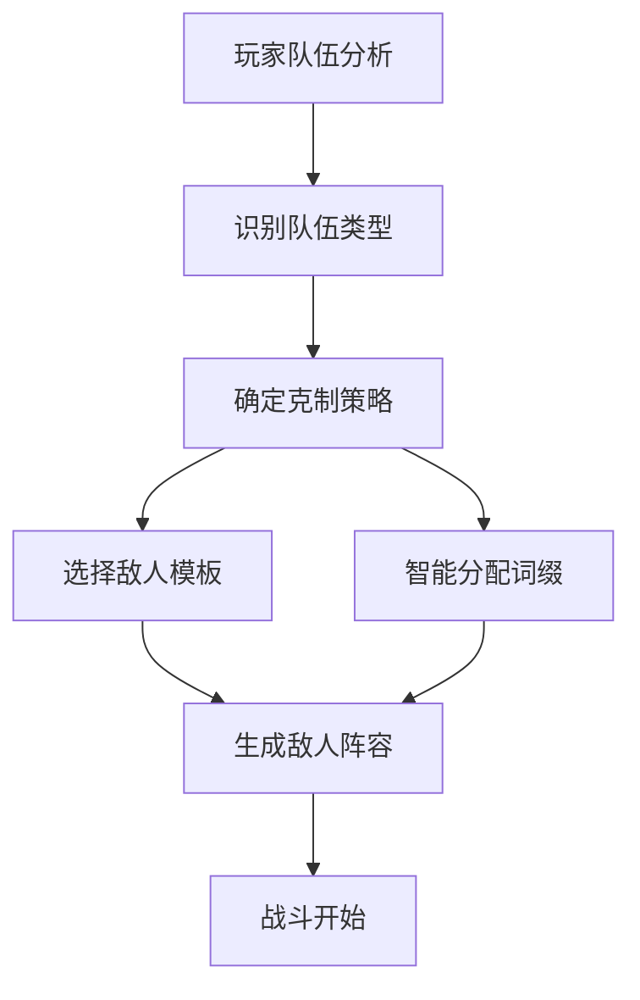
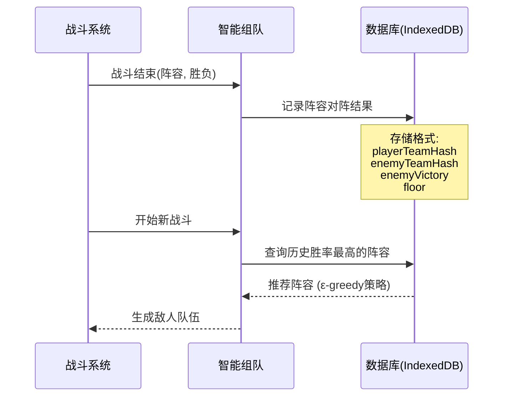

# 智能敌人组队系统设计方案 v2.0

> **版本**: v2.1
> **状态**: 正在实现
> **前置条件**: 职业系统 (已就绪), 行动条系统 (已就绪)
> **创建日期**: 2026-01-12

## 概述

让AI从**敌人组队阶段**就开始针对玩家，而不只是战斗中的决策。AI会分析玩家队伍特点，生成最佳的敌人阵容和词缀组合来克制玩家。

## 核心流程



## 玩家队伍分析维度

| 维度 | 识别方式 | 针对策略 |
|------|----------|----------|
| **治疗能力** | 包含 `Healer` (医疗) 职业或 `healer` 标签 | 配置高爆发+刺客优先击杀 |
| **召唤能力** | 包含 `Summoner` (召唤) 标签 (如缪尔赛思) | 刺客斩首召唤师 |
| **高爆发** | 高ATK+爆发技能 (如艾雅法拉) | 不死/分裂词缀+坦克吸收 |
| **控制能力** | 拥有眩晕/冻结等技能 | 高速敌人抢先行动 |
| **高速度** | 高SPD角色 (如红/陈) | 更高速度敌人 (Swift词缀) |

## 敌人角色定位

### 坦克定位
- **模板**: 重装兵、精英士兵
- **特点**: 高HP + 高DEF
- **最佳词缀**: 
  - 嘲讽(taunt) - 强制敌人优先攻击
  - 闪避(dodge) - 20%闪避率
  - 不死(undying) - 首次致死恢复30%HP
  - 坚韧(fortify) - DEF+25%

### 刺客定位
- **模板**: 萨卡兹战士、红(敌人版)
- **特点**: 高ATK + 高SPD
- **最佳词缀**:
  - 迅捷(swift) - SPD+15
  - 狂化(berserk) - HP低于30%时ATK+50%
  - 吸血(vampiric) - 造成伤害恢复15%

### 法师定位
- **模板**: 术师、萨卡兹术师
- **特点**: 高ATK (法术伤害)
- **最佳词缀**:
  - 连击(multiStrike) - 30%概率攻击两次
  - 狂化(berserk) - HP低于30%时ATK+50%

### 辅助定位
- **模板**: 医疗兵、高级医疗兵
- **特点**: 有治疗技能
- **最佳词缀**:
  - 回血(regen) - 每回合恢复5%HP
  - 光环(aura) - 队友ATK+15%

## 行动条/速度对抗策略 (Action Gauge Counter)

由于战斗系统基于 CT (Charge Time) 行动条机制，速度 (SPD) 决定了行动频率。针对高速玩家队伍，需要特定的反制手段。

### 1. 速度压制 (Speed Blitz)
*   **针对对象**: 低速高防队伍、奶盾流
*   **策略**: 部署 2-3 名带有 `swift` (迅捷) 词缀的刺客。
*   **效果**: 利用高 SPD 快速跑满行动条，在玩家行动前进行多次攻击，尝试造成减员。

### 2. 行动条干扰 (Turn Manipulation)
*   **针对对象**: 高速玩家队伍
*   **策略**: 
    *   **推条**: 敌人技能带有减少目标 Action Gauge 的效果 (待实现)。
    *   **眩晕**: 使用眩晕 (Stun) 强制跳过回合 (相当于 Action Gauge -= 10000)。
*   **实现**: 优先选择带有控制技能的精英敌人 (如萨卡兹术师的诅咒)。

### 3. 后手反击 (Counter Attack)
*   **针对对象**: 极高速度但脆皮的队伍 (如特种队)
*   **策略**: 部署带有 `thorns` (荆棘) 和 `undying` (不死) 的坦克。
*   **效果**: 让玩家的高频攻击触发反伤，利用不死词缀承受第一波爆发，然后反击。

## 针对策略表

| 玩家特征 | 优先敌人类型 | 目标优先级 | 推荐词缀 |
|----------|-------------|-----------|---------|
| 有治疗 | 刺客 | 先杀治疗 | swift, berserk |
| 有召唤师 | 刺客 | 先杀召唤师 | swift |
| 高爆发 | 坦克 | 吸收伤害 | undying, split, fortify |
| 有控制 | 法师 | 抢先手 | swift |
| 高速度 | 法师/刺客 | 更快行动 | swift, thorns |

## 学习机制 (Reinforcement Learning Lite)

系统将记录每种敌人阵容对阵特定玩家阵容的胜率，并随着时间推移倾向于选择胜率更高的阵容。



### 数据库结构 (IndexedDB: SmartAI_DB)

新增 store: `teamMatchHistory`

```javascript
{
  id: 自增ID,
  playerTeamHash: '基于职业和关键角色的哈希', 
  enemyTeamHash: '敌人阵容哈希',
  enemyComposition: [{ role, affixes }, ...], // 简化的阵容描述
  floor: 层数区间 (e.g. 20, 30, 40...),
  result: 'win' | 'lose', // 敌人视角
  timestamp: 时间戳
}
```

## 代码结构规划

### 1. `js/endless_and_smartAI/smartAI_data.js`
- 更新数据库版本，添加 `teamMatchHistory` 表。

### 2. `js/endless_and_smartAI/smartAI_teamBuilder.js` (新文件)
- `SmartTeamBuilder` 对象
  - `analyzePlayerTeam(playerTeam)`: 返回特征标签数组
  - `generateCounterTeam(playerTraits, floor, enemyCount)`: 生成敌人数据
  - `recordMatchResult(...)`: 保存战斗结果
  - `getBestCounterTeam(...)`: 查询历史最佳

### 3. `js/endless_and_smartAI/endless.js`
- 集成点: `generateEnemies()`
- 集成点: `onVictory` / `onDefeat` (调用记录接口)

## 实现步骤

1. **数据库升级**: 修改 `smartAI_data.js`。
2. **核心逻辑实现**: 创建 `smartAI_teamBuilder.js`。
3. **集成测试**: 在无尽模式中挂载逻辑。